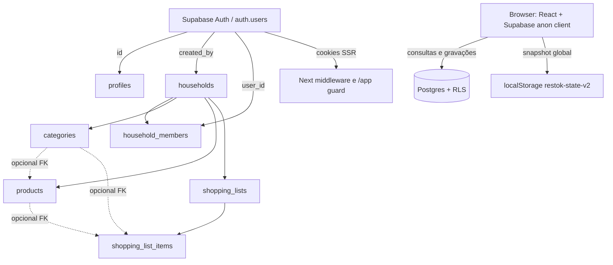
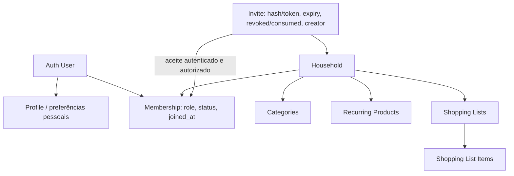

# Autenticação e multi-tenancy

**Data:** 30/09/2026 · **Status:** diagnóstico; sem correções aplicadas.

## Current Auth Flow

1. `/login` chama Supabase Auth no browser com email/senha (`signInWithPassword`) ou `signUp`; signup envia `full_name` como metadata e define callback.
2. Com confirmação de email, `/auth/callback` executa `exchangeCodeForSession(code)`. Middleware Supabase SSR atualiza/valida cookie para `/app/*` e `/auth/*`; a rota `/app` valida o usuário com `auth.getUser()` e redireciona sessão ausente a `/login`.
3. O browser client e o server client usam URL + anon key públicas. O código não usa service role. A sessão é mantida pelo adapter `@supabase/ssr` em cookies e é validada com `getUser()`.
4. Recuperação chama `resetPasswordForEmail` com redirect para `/login`; não existe página/estado que aplique a nova senha depois do retorno.
5. Não há chamada `signOut`, endpoint de encerramento, nem controle real de perfil.

O nome de signup é enviado apenas como Auth user metadata (`full_name`). Não há trigger de criação/cópia na migration; `loadRemoteState()` faz `upsert({id:user.id})`, portanto não grava `display_name`. O perfil persistido não recebe o nome digitado.

`next` bloqueia `//` mas aceita `/\host`; o parser `URL` normaliza a barra invertida como separador de authority e permite redirect externo. Callback também ignora erro de troca de code e redireciona.

### Diagrama atual



## Current Data Ownership Model

- Identidade é `auth.users.id`.
- Perfil é opcional, PK/FK `profiles.id -> auth.users.id`.
- Household tem UUID, nome, `created_by` e timestamp.
- Membership tem `household_id`, `user_id`, `role` (`owner/member`) e unique `(household_id,user_id)`. Isso permite múltiplas casas por usuário.
- Categorias/produtos/listas carregam `household_id`; item de lista deriva sua casa via `shopping_list_id`.
- `created_by` em household/lista é ownership de criação. A maior parte das permissões usa membership, mas operações de household/member usam `created_by`, enquanto `role` quase não é usado.
- `lib/types.ts` não representa user, household, membership ou convite; estado do app é só produtos e listas.

## Current Household Model

Primeiro acesso ao dado remoto faz `SELECT household_members WHERE user_id = auth.uid() LIMIT 1`. Se não encontrar membership, o browser cria household `Minha casa`, em seguida membership `owner`, profile, categorias, produtos, lista e itens iniciais. Os passos não são transacionais. Uma falha entre chamadas pode deixar registros parciais. A ordem de seleção não identifica qual casa está ativa quando há várias.

Não há onboarding explícito de household, seletor, lista de membros, papel apresentado, saída da casa ou remoção na interface. A casa mostrada é fixada como “Casa Gabriel & Brunna”. Compartilhar chama RPC `create_household_invite()` e copia `/app?invite=<token>`. O boot aceita o token antes de carregar state remoto; usuário autenticado sem casa entra pelo household do convite. Quem já está em outra casa é membro da segunda, mas a resolução `LIMIT 1` mantém a primeira sem opção de trocar.

## Problems and Security Risks

### AUTH-001 — P0: membership autoatribuível rompe RLS

Migration: policy `members can add membership`, linha 152:

```sql
with check (
  user_id = auth.uid()
  or exists (
    select 1 from public.households
    where id = household_id and created_by = auth.uid()
  )
)
```

Qualquer usuário autenticado pode enviar `INSERT household_members(household_id, user_id, role)` para uma casa alheia, com seu próprio `user_id`; a primeira condição não verifica invite nem que o household lhe pertença. A policy não valida `role`. Depois, `is_household_member(household_id)` retorna true e concede acesso às policies de categories, products, lists e items daquela casa. Isto é bypass de authorization no banco, não só filtro de UI. Conhecer UUID alvo é pré-requisito operacional, não uma barreira de autorização; o helper `household_for_list` aumenta a exposição de metadados (AUTH-008). Não testado no projeto remoto.

### Convites

- Token tem 144 bits aleatórios e expira em 14 dias — bons aspectos.
- RPC `accept_household_invite` exige login, confere token e expiração, insere membership idempotente; não consome/revoga o token nem associa destinatário. O mesmo bearer continua válido para múltiplos usuários.
- Todos os membros leem `household_invites`, incluindo token em claro; um membro pode copiar/reutilizar convite.
- `create_household_invite` escolhe a primeira membership por `created_at`, não aceita household alvo e não verifica owner/admin. Qualquer membro pode gerar convite.
- Não há recusa, revogação, limite, audit trail nem feedback de aceite. A UI ignora o boolean de `acceptHouseholdInvite`.

### Membership e ciclo de vida

- `role` não governa as policies; `created_by` é usado como proxy de owner. Pode haver divergência entre `household_members.role='owner'` e `households.created_by`.
- Qualquer usuário consegue auto-inserir membership, e o criador consegue adicionar outras identidades diretamente. Não há verificação de invite nem promoção segura.
- Só `created_by` consegue remover membership. Um membro não consegue sair; o owner pode remover a própria membership e não há transferência/garantia de outro administrador.
- Memberships duplicadas da mesma pessoa/casa são prevenidas por unique constraint. Múltiplas casas por usuário são permitidas (e não há seleção de casa na UI). Casa duplicada/orphan por chamada parcial ou concorrência continua possível.
- A criação household → membership não é uma transação nem possui unique constraint que imponha uma casa inicial; duas sessões concorrentes podem criar casas duplicadas.

### RLS, RPC e integridade

- RLS está ligada em todas as oito tabelas atuais e policy de lista/produtos usa membership; isto é boa base, porém AUTH-001 inutiliza a fronteira.
- Migration concede todos os verbos CRUD a `authenticated` em todas as tabelas; ausência de policy específica pode ser decisiva e grants devem ser revisados tabela a tabela.
- `profiles SELECT USING (true)` revela nome/avatar de todos os usuários autenticados.
- `household_for_list(uuid)` é `SECURITY DEFINER`, retorna o tenant ID para qualquer list id, não valida usuário e não revoga `EXECUTE` de `PUBLIC`. PostgreSQL concede EXECUTE a PUBLIC por padrão em funções novas; com RPC do PostgREST habilitado, isso permite resolver household IDs para UUIDs de lista conhecidos.
- `is_household_member` também é SECURITY DEFINER, mas só retorna boolean de membership do próprio `auth.uid()`; mantenha `search_path` fixo e permissões restritas em qualquer helper de policy.
- FK `product_id`/`category_id` em item e `category_id` do produto não garantem household igual ao da lista/produto. Um membro pode gravar FK de outro tenant se conhecer o ID. Integridade referencial existe, integridade de tenant não.
- Nenhuma tabela de Storage foi criada/configurada. Não há policy de Storage a auditar nesta migration.
- `created_by ON DELETE RESTRICT` em household/lista pode impedir remoção de conta; não há processo de exclusão/portabilidade de dados.

### Client, queries e autorização

As queries diretas usam anon key e incluem filtro `household_id` escolhido por `getRemoteContext`; isso reduz leitura acidental, mas frontend não é boundary de segurança. RLS é aplicada a cada query e é a autoridade efetiva. `persistProduct`/`persistList` enviam `household_id` e `created_by` do cliente; RLS controla membership e owner, porém a policy de update de lista não restringe mudança de `created_by`. `persistItem` envia `shopping_list_id`/FK diretamente; policy verifica tenant derivado da lista, mas não consistência tenant de FK.

`localStorage` é único entre contas do browser; erros remotos são ignorados e o cache pode ser mostrado/regravado. Isso não contorna RLS, mas expõe cache local entre sessões no mesmo device/browser.

## Recommended Domain Model

Manter o household como tenant raiz dos dados compartilhados, sem transformar a conta pessoal em dono de todas as entidades. O próprio produto tem uma lista ativa por household e colaboração doméstica; portanto a hierarquia conceitual adequada é:



Usuário pode ter várias memberships no modelo relacional, se o produto pretende suportar casas múltiplas; app deve ter household ativo explícito e nunca resolver via `LIMIT 1` arbitrário. Se decisão de produto for exatamente uma casa por usuário, implementar constraint/invariante transacional; não depender de comportamento casual da query.

Profile é pessoal e só deve ser visível a membros relacionados quando necessário. Households, membership e convites necessitam operações de lifecycle explícitas. Products/categories/lists são sempre tenant-scoped. Items herdam tenant da lista e FKs devem garantir que produto/categoria pertencem ao mesmo household ou gravar snapshot sem FK inter-tenant.

## Recommended Authorization Model

1. Remover auto-membership aberta. Criação inicial de household+owner membership ocorre numa única transação/RPC de onboarding autenticada; aceitar convite é o único caminho para adicionar um membro existente.
2. Definir role canonical (ownership em membership; `created_by` preservado como auditoria, não authority paralela). Separar `owner/admin/member` apenas se houver permissões diferentes e aplicá-las em SQL.
3. RLS de leitura/escrita usa `EXISTS membership` sobre `auth.uid()` no tenant do registro. Alterar tenant ou criador em update deve ser proibido, salvo ação de transferência explicitamente autorizada.
4. Remover grants indiscriminados quando possível; conceder operações necessárias por tabela. Para RPC `SECURITY DEFINER`, qualificar schemas, fixar `search_path`, verificar `auth.uid()`, validar role/target, limitar EXECUTE aos papéis exigidos e não retornar dados desnecessários.
5. Convite: entropia forte (manter), guardar hash do token ou restringir leitura, expiração e revogação explícitas, uso único ou limite claramente escolhido, transação de aceite e resposta indistinguível para token desconhecido/expirado quando adequado. RPC precisa identificar household pretendido e autorização do criador.
6. Garantir integridade por FKs compostas/constraints/triggers de tenant e índices compatíveis. Não confiar em `household_id` enviado pelo browser.
7. Cache local com chave de sessão/tenant, limpeza na troca/logout, sem tratá-lo como fonte após falha de rede; distinguir cache offline explícito de estado carregado do servidor.

### Migração / cuidados

- Revisar dados existentes em ambiente seguro: memberships por usuário, owners que divergem de `created_by`, memberships sem household (FK atual impede), household sem membership, listas/produtos com categoria/produto de outro tenant, convites expirados/ativos e listas criadas sem membership atual.
- Há uma migration inicial já aplicada possivelmente em deploy; correção precisa ser uma migration aditiva/alteração versionada, não reescrever a migration aplicada. Revalidar políticas permissivas cumulativas (policies PostgreSQL podem OR entre si) e grants/default privileges.
- Fechar a falha antes de backfill estrutural. Antes de revogar membership sem convite, preservar memberships legítimas e identificar ataques/associações incorretas; não remover dados automaticamente.
- Decidir papel/transferência e política de saída antes de constraint de último owner. Backup e rollback explícitos; fazer dry-run com cópia de banco.
- Nada deste documento autoriza aplicação em projeto remoto. A sequência recomendada começa por reproduzir/fixar num projeto de teste Supabase com dois tenants.

## Required Tests

### Banco / integração (anon, usuário A e usuário B)

- Usuário sem membership não lê/escreve household/lista/produtos de outro tenant mesmo conhecendo UUID e chamando REST/RPC diretamente.
- Usuário A não pode criar membership própria ou de B sem convite válido; não pode setar `role=owner`; B e um membro da Casa A têm somente operações autorizadas.
- Convite válido aceita uma vez conforme política escolhida; expirado/revogado/consumido é rejeitado; destinatário existente e recém-cadastrado seguem fluxo; token não aparece em listagem de membros.
- Owner/admin convida/remove; member não remove nem escala privilégio; owner não pode deixar casa sem owner sem transferir; saída revoga acesso imediatamente.
- Item não pode referenciar categoria/produto de household diferente; mudar `household_id` no UPDATE é negado.
- Perfil não é legível fora do escopo autorizado; helper de policy não funciona como RPC pública para enumerar IDs.
- Cascade e exclusão de usuário/casa preservam regras de propriedade e histórico planejadas.

### E2E

Signup/confirm → primeiro household → lista; login/logout/sessão/recovery; household A, B e membro C; criar/copiar/aceitar/revogar convite; trocar casa se multi-household; marcar item numa sessão e ver em outra; acesso direto a IDs de outro household falha; recuperação de conexão e retorno de cache scoped.
