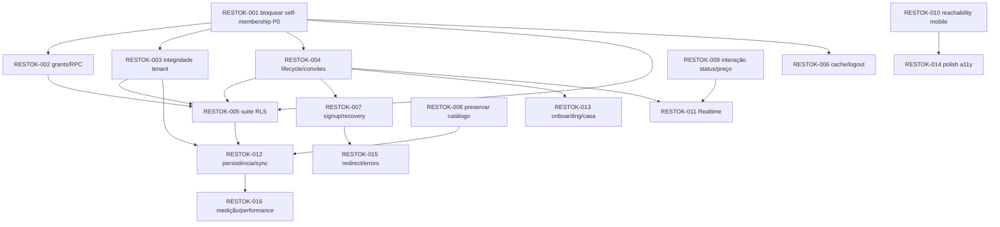

# Plano de correção do Restok

**Data:** 30/09/2026  
**Estado:** backlog para próxima etapa. Este documento não aplica alterações no app ou banco.

## Ordem recomendada

Não lançar novas features nem operar dados multi-tenant até fechar e verificar RESTOK-001. Fazer correções por migrations aditivas, primeiro em projeto Supabase de teste com tenants A/B/C; somente depois planejar promoção. O app pode manter Next/Supabase e o client direto com RLS — não há justificativa para reescrita geral.

## Fases

### Phase 0 — Data/Security Emergency

- Remover auto-membership arbitrária e impedir forja de papel.
- Restringir helpers `SECURITY DEFINER`/RPC e grants; revisar perfil público.
- Reproduzir leitura/escrita cruzada diretamente pelo PostgREST com A/B antes/depois da migration.
- Não limpar membership existente até classificar associações válidas e suspeitas.

### Phase 1 — Authentication & Tenant Isolation

- Tratar household como tenant explícito em consultas e validações; reforçar integridade de tenant nas FKs.
- Namespace do cache por usuário + household e estratégia ao trocar sessão.
- Criar suíte automatizada de RLS e IDsOR antes de ampliar autorização.

### Phase 2 — Household Architecture

- Definir canonical owner/admin/member, uma ou várias casas por usuário e política de último owner.
- Household ativo e troca de casa, criação transacional, membership lifecycle e invitation lifecycle.

### Phase 3 — Registration & Onboarding

- Corrigir recovery, sessão/logout e fluxo de cadastro para levar à criação/entrada de casa e primeira lista.
- Evitar seed operacional destrutiva; mostrar empty state e estados de falha reais.

### Phase 4 — Mobile First Foundation

- Corrigir reachability da lista atrás do rodapé fixo; provar o final de listas em alturas e larguras reais.
- Garantir teclado, safe area e navegação no viewport de smartphone.

### Phase 5 — Core Shopping UX

- Tornar marcar comprado rápido, consistente com preço e reversível; continuar compatível com uma mão.

### Phase 6 — Reliability & Performance

- Erros/retry/outbox offline, writes agrupadas/atômicas, sincronização completa e índices adequados.

### Phase 7 — Accessibility & Polish

- Dialog acessível, states de navegação, targets, copy, landing mobile.

### Phase 8 — Tests & Hardening

- E2E de conta/casa/compra e isolamento em ambiente descartável; auditoria de migration/deploy, observabilidade e regressão da matriz viewport.
- Os testes críticos de segurança devem iniciar já na Phase 0; esta fase consolida a suite, não posterga o teste até o fim.

## Cards de implementação

## RESTOK-001 — Fechar auto-membership e role forjada

### Severity
P0

### Problem
Policy permite que qualquer usuário autenticado se insira em qualquer household conhecido, sem convite; também deixa `role` livre. Essa membership ativa todas as policies de tenant.

### Evidence
`supabase/migrations/20260901000000_initial_schema.sql:151-153`, AUTH-001 em `AUTH_AND_MULTI_TENANCY.md`.

### Root Cause
Uma policy de insert representa dois fluxos incompatíveis: auto-join e ação de owner. RLS não exige token/membership autorizada nem valida papel.

### Proposed Solution
Criar migration aditiva removendo a via self-insert direta. Permitir membership apenas por RPC transacional de aceite de convite validado; onboarding cria household e owner membership atomicamente. Validar `role` no servidor e limitar operação de criação/alteração de role a owner/admin. Não depender de frontend.

### Files / Areas Affected
`supabase/migrations/*`; possivelmente `lib/supabase/data.ts` para migrar bootstrap; integração Supabase REST/RPC.

### Acceptance Criteria
- [ ] Usuário autenticado sem convite não consegue inserir membership própria em household A nem membership de terceiro.
- [ ] Alterar payload para `role=owner` falha.
- [ ] Convite válido é o único caminho de entrada e atribui papel inicial permitido.
- [ ] Membership já legítima de A continua operando; acesso de B continua negado.
- [ ] Migration testada de forma aditiva, sem modificar migration já aplicada.

### Required Tests
- Unit: validação role/token (se lógica no app).
- Integration: SQL/RLS via REST com usuários A/B/C anon/authenticated.
- E2E: request direto com ID de casa/lista, membership arbitrária negada.

### Dependencies
Nenhum. Bloqueia RESTOK-003/004/005.

### Risk
High

## RESTOK-002 — Reduzir superfície de RPC e grants

### Severity
P1

### Problem
`household_for_list` é SECURITY DEFINER sem verificação de usuário e EXECUTE público padrão; policy de perfis permite select global; grants CRUD são amplos.

### Evidence
Migration `:90-98,143,165-168`; AUTH-007/008.

### Root Cause
Helper interno de policy está no schema API `public` e recebe privilégios de SECURITY DEFINER sem revogar PUBLIC. Profiles não possuem escopo.

### Proposed Solution
Rever se `household_for_list` pode ser simplificada/privada; se mantida, revogar EXECUTE de `PUBLIC/anon/authenticated` conforme necessidade real e conceder somente a policy/RPC necessária. Restringir leitura de perfil a si/membros autorizados. Remover grants CRUD desnecessários e revisar policies acumuladas.

### Files / Areas Affected
Migration Supabase; inventário de grants/policies; `lib/supabase/*` se queries precisarem de perfil.

### Acceptance Criteria
- [ ] Usuário anon não consegue resolver lista → household por RPC.
- [ ] Usuário autenticado fora do escopo não consegue enumerar perfil.
- [ ] Papéis só têm verbos necessários e policies negam operações sem regra.
- [ ] Revalidado no PostgREST, não somente por `SET ROLE`/SQL owner.

### Required Tests
- Unit: nenhum.
- Integration: RPC privilege catalog + chamadas REST anon/A/B.
- E2E: consulta de perfil de usuário fora do household retorna negado/ausente.

### Dependencies
Pode ser desenvolvido junto a RESTOK-001; integração final depende de RESTOK-001.

### Risk
Medium

## RESTOK-003 — Impor integridade referencial entre tenants

### Severity
P1

### Problem
FKs de categoria/produto verificam apenas existência, não household igual à lista/produto dono.

### Evidence
Migration `:49-53,75-80`; `persistItem` envia IDs fornecidos pelo estado do cliente.

### Root Cause
Tenant está representado em tabelas-pai, mas constraints não incorporam `household_id`.

### Proposed Solution
Escolher e migrar o menor modelo seguro: constraints compostas `(household_id,id)` com FK na lista/item, ou trigger validando tenant. Para item, determinar household via lista e verificar category/product. Tratar item manual/snapshot sem product_id como caso válido.

### Files / Areas Affected
Migration/schema, `lib/supabase/data.ts`, possíveis tipos/serialização.

### Acceptance Criteria
- [ ] Produto/categoria de B não pode ser associado a produto de A ou item da lista de A.
- [ ] Exclusão de produto/categoria preserva histórico conforme regra planejada.
- [ ] Seed e itens manuais legítimos continuam persistindo.

### Required Tests
- Unit: validação de domínio se adicionada.
- Integration: tentativas de FK cruzada nos dois sentidos e controles intra-tenant.
- E2E: adulterar payload da criação de item não cria vínculo externo.

### Dependencies
RESTOK-001 para garantir acesso seguro durante backfill; requer auditoria de registros antes de adicionar constraint.

### Risk
High

## RESTOK-004 — Definir lifecycle de memberships e convites

### Severity
P1

### Problem
Papéis são ambíguos, qualquer membro cria convite, token legível/reutilizável, sem revogação, membro não sai e último owner pode se remover.

### Evidence
Migration `:21-37,107-130,149-155`; UI `shareHousehold` em `components/restok-app.tsx:645`.

### Root Cause
`created_by` e `role` competem como autoridade; convite é token bearer sem lifecycle. Não há UI/casos de uso de administração.

### Proposed Solution
Definir permissão owner/admin/member, se convite será link reutilizável com limite ou uso único, expiração, revogação e política de saída/transferência. Implementar RPC transacional e regras de último owner; exibir membros e estado do convite. Manter tokens ocultos de membros não autorizados.

### Files / Areas Affected
Migration/RPC, `lib/types.ts`, `lib/supabase/data.ts`, `components/restok-app.tsx`, UI de Casa.

### Acceptance Criteria
- [ ] Novo usuário pode entrar via convite; usuário existente e recém-cadastrado recebem resultado inequívoco.
- [ ] Convite expirado/revogado/consumido falha; comportamento de reuso segue decisão documentada.
- [ ] Member não promove/remova owner; acesso revoga imediatamente após saída/remoção.
- [ ] Último owner recebe fluxo de transferência ou bloqueio; casa não fica órfã.
- [ ] Membro autorizado não recebe todos os tokens ativos por SELECT.

### Required Tests
- Unit: transições de membership/invite.
- Integration: RLS/RPC e concorrência de aceite/remoção.
- E2E: criar convite, ingressar C, recusar/expirar/remover/sair.

### Dependencies
RESTOK-001 e decisão de produto sobre uma vs várias casas e papel canonical.

### Risk
High

## RESTOK-005 — Criar suite A/B/C de autorização como bloqueio

### Severity
P1

### Problem
Não há testes de banco/auth/multi-tenancy que provem a fronteira; os 2 testes atuais são utilitários.

### Evidence
`package.json` Vitest only; `lib/utils.test.ts`; sem Playwright/Supabase integration.

### Root Cause
RLS foi criada sem harness multi-user nem teste de request direto.

### Proposed Solution
Criar projeto Supabase local/teste descartável ou pipeline com stack isolada; sem apontar para `.env` de produção. Fixtures usuário A/C em Household A e B em Household B. Fazer requests via anon key, não usar service role para as assertions.

### Files / Areas Affected
`package.json`, scripts/test helpers, `supabase/config.toml`/local setup quando adotado, integration/e2e.

### Acceptance Criteria
- [ ] A/C compartilham só Household A e B acessa só B.
- [ ] Leitura, update, delete e RPC diretos com IDs alterados têm assertions.
- [ ] Teste de AUTH-001 falha antes e passa depois da migration.
- [ ] CI não usa credenciais ou dados de produção.

### Required Tests
- Unit: policy helper parsing não substitui integração.
- Integration: RLS completa A/B/C + RPC.
- E2E: login/logout/convite/lista em navegador de teste.

### Dependencies
Harness pode começar em paralelo; assertions de aceite dependem RESTOK-001/002/003/004.

### Risk
Medium

## RESTOK-006 — Escopar cache e completar logout/troca de sessão

### Severity
P1

### Problem
Cache de estado global não está separado por usuário/household e interface não encerra sessão.

### Evidence
`components/restok-app.tsx:539-557,652`; `restok-state-v2`; sem `signOut`.

### Root Cause
Persistência local é tratada como cache de domínio sem lifecycle de sessão.

### Proposed Solution
Namespace cache com identidade/household após `getUser`; descartar cache não correspondente; limpar ao logout/troca de usuário. Adicionar logout e estado real de perfil. Tratar cache como offline explícito, não fallback silencioso de erro remoto.

### Files / Areas Affected
`components/restok-app.tsx`, `lib/supabase/*`, componente menu/perfil.

### Acceptance Criteria
- [ ] Browser com cache A autenticado como B nunca renderiza dado A.
- [ ] Logout revoga sessão server/client e limpa contexto sensível local.
- [ ] Reload mantém cache apenas do mesmo usuário/household autorizado.
- [ ] Falha de rede não apresenta cache de outro tenant nem comunica sucesso remoto.

### Required Tests
- Unit: cache key/identity transition.
- Integration: sessão/cookie e signOut.
- E2E: A logout → B login no mesmo browser sem conteúdo residual A.

### Dependencies
RESTOK-001; escolha de household ativo conforme RESTOK-004.

### Risk
Medium

## RESTOK-007 — Corrigir criação de conta, household e recuperação

### Severity
P1

### Problem
Signup é apresentado como conta da casa mas não conclui casa; recovery não define nova senha; erro de auth e callback não têm estados completos.

### Evidence
`app/login/page.tsx:51-67,85-90`; `app/auth/callback/route.ts`; household auto-criado em `lib/supabase/data.ts:17-23`.

### Root Cause
Auth e onboarding estão separados e provisioning ocorre como efeito colateral de load.

### Proposed Solution
Modelar `callback?flow=recovery` com tela de nova senha; após signup/confirm, iniciar criação ou aceite de convite antes da seed. Tornar household create transactionado, pedir/confirmar nome quando apropriado e mostrar estados de erro/retry. Sanitizar `next` por allowlist de paths locais.

### Files / Areas Affected
`app/login/page.tsx`, `app/auth/callback/route.ts`, `app/app/page.tsx`, `lib/supabase/data.ts`, tipos de onboarding.

### Acceptance Criteria
- [ ] Usuário consegue concluir redefinição pelo link e entrar com nova senha.
- [ ] Signup confirmado conduz a criar ou entrar numa casa sem registro parcial.
- [ ] `next` não leva a host externo via `//`, barra invertida, encoding ou scheme.
- [ ] Erros têm ação recuperável e não deixam botão em loading infinito.

### Required Tests
- Unit: redirect allowlist e onboarding state transitions.
- Integration: Auth confirmation/recovery em Supabase de teste.
- E2E: cadastro, confirmação simulada, reset, nova senha, login.

### Dependencies
RESTOK-001/004 para fluxo seguro de membership.

### Risk
Medium

## RESTOK-008 — Preservar catálogo customizado no bootstrap

### Severity
P1

### Problem
Seed é reaplicada em cada carga e redefine campos/edit state de produtos correspondentes.

### Evidence
`lib/supabase/data.ts:48-60` atualiza `name`, `category_id`, `default_quantity`, `active` sempre.

### Root Cause
Migração de catálogo demo é usada como fonte autoritativa em runtime.

### Proposed Solution
Seed somente na criação inicial/versão de migration; para usuários existentes, aplicar migration de catálogo com diff explícito e nunca sobrescrever campos editáveis. Desativação deve persistir como usuário decidiu.

### Files / Areas Affected
`lib/supabase/data.ts`, `lib/seed.ts`, migration de dados se necessária.

### Acceptance Criteria
- [ ] Nome/quantidade/categoria editados sobrevivem reload.
- [ ] Produto desativado não é reativado no boot.
- [ ] Household novo continua recebendo catálogo inicial exatamente uma vez.
- [ ] Atualização deliberada de catálogo tem diff auditável e sem apagar histórico.

### Required Tests
- Unit: seed idempotence / reconciliation.
- Integration: load duas vezes e comparação com personalizações.
- E2E: editar, desativar, sair/entrar e conferir.

### Dependencies
Pode começar em paralelo após definir ownership do catálogo; não depende do novo UI de casa.

### Risk
Medium

## RESTOK-009 — Fazer compra e preço terem estado coerente

### Severity
P1

### Problem
Preço preenchido promete marcar comprado, mas item pode continuar pendente; fluxo exige passos durante compra.

### Evidence
`ItemEditorSheet` em `components/restok-app.tsx:319-323,345,348-360`; linhas principais `:263-280`.

### Root Cause
Preço e status são controles independentes apesar de copy/regra de domínio acopladas.

### Proposed Solution
Definir transição inequívoca: compra + preço em ação clara e rápida, conservar “já temos” sem total, permitir undo. Corrigir cálculo/copy; permitir status por toque direto sem obrigar editar nome/quantidade.

### Files / Areas Affected
`components/restok-app.tsx`, helpers `lib/utils.ts`, tipos e aria labels.

### Acceptance Criteria
- [ ] Registrar preço conforme a ação definida produz estado comprado e total correto.
- [ ] “Já temos” não soma preço e pode ser desfeito.
- [ ] Ação primária cabe num fluxo de uma mão e não requer abrir detalhes.
- [ ] Duas pessoas veem a transição corretamente após sync.

### Required Tests
- Unit: state transition, subtotal e status.
- Integration: persistência do status/preço.
- E2E: adicionar preço, marcar/undo e conferir filtro/total.

### Dependencies
RESTOK-011 para consistência completa entre sessões; UI pode prototipar em paralelo.

### Risk
Medium

## RESTOK-010 — Corrigir espaço do rodapé em viewport mobile

### Severity
P1

### Problem
Barra fixa e nav cobrem o item final da lista no scroll máximo.

### Evidence
Percurso demo local em viewport ~525×852; código `components/restok-app.tsx:651,663-664`.

### Root Cause
Padding inferior de `main` não considera a altura real combinada de summary, navigation e safe area/FAB.

### Proposed Solution
Centralizar altura/offset do rodapé em layout responsivo ou reservar `padding-bottom` equivalente às superfícies fixas; considerar esconder/compactar summary durante scroll/teclado sem tapar item.

### Files / Areas Affected
`components/restok-app.tsx`, `app/globals.css`/tokens responsivos.

### Acceptance Criteria
- [ ] Último item visível acima dos controles quando scroll chega ao limite.
- [ ] FAB, resumo e nav não se sobrepõem a conteúdo/foco/teclado.
- [ ] Validado 320, 360, 375, 390, 412, 430px e alturas pequenas com safe area.
- [ ] Sem overflow horizontal.

### Required Tests
- Unit: nenhum.
- Integration: nenhum.
- E2E: screenshot/scroll-to-end com lista de 44+ itens na matriz mobile.

### Dependencies
Independente de backend; pode iniciar junto de RESTOK-009 após hotfix P0.

### Risk
Low

## RESTOK-011 — Completar sync de inserções e estados remotos

### Severity
P1

### Problem
Realtime não adiciona `INSERT`; só atualiza itens presentes ou remove DELETE e não escuta listas/produtos.

### Evidence
`components/restok-app.tsx:575-597`; `lib/supabase/realtime.ts`.

### Root Cause
Handler trata payload como update de coleção preexistente.

### Proposed Solution
Aplicar INSERT/UPDATE/DELETE idempotentes com deduplicação, refresh/fallback em gap, subscription state e mensagens só quando state realmente mudar. Escutar mudanças de domínio necessárias ou revalidar snapshot ao voltar online.

### Files / Areas Affected
`lib/supabase/realtime.ts`, `components/restok-app.tsx`, `lib/supabase/data.ts`.

### Acceptance Criteria
- [ ] Item novo adicionado por C aparece uma vez para A e B.
- [ ] Update, DELETE, reconnect e eventos repetidos não duplicam/nem removem incorretamente.
- [ ] Falha de channel mostra desconectado/reconectando e revalida.
- [ ] Mudanças de produto/lista têm comportamento definido.

### Required Tests
- Unit: reducer/payload application.
- Integration: Supabase Realtime test project.
- E2E: dois contextos de browser compartilham household.

### Dependencies
RESTOK-001/004; validar depois de RESTOK-003 e modelo de household ativo.

### Risk
Medium

## RESTOK-012 — Tornar gravações confiáveis em rede móvel

### Severity
P1

### Problem
Requests ignoram errors; UI dá toast de sucesso imediatamente; criação de lista grava cada item com repeated auth/membership/category lookups.

### Evidence
`lib/supabase/data.ts:37-86,103-122`; `components/restok-app.tsx:604-645`.

### Root Cause
Repository não retorna resultado e cada operação busca contexto novamente. Não há batch, atomicidade, retry ou outbox.

### Proposed Solution
Retornar resultado tipado; compartilhar `RemoteContext`; agrupar operações (RPC/transação ou inserts em lote quando RLS permite); estados pending/failed/retry e estratégia de reconciliação offline que não confirme até haver persistência definida.

### Files / Areas Affected
`lib/supabase/data.ts`, `components/restok-app.tsx`, RPC/schema e UI de feedback.

### Acceptance Criteria
- [ ] Falha de write é mostrada e recuperável; UI não declara sync quando não confirmado.
- [ ] Retry idempotente não duplica item/lista.
- [ ] Criar compra não deixa lista vazia/parcial em falha intermediária.
- [ ] Número de requests por criação de lista deixa de escalar como auth+category query por item.
- [ ] UX em offline/reconnect tem contrato documentado e testado.

### Required Tests
- Unit: resultado, idempotência e retry state.
- Integration: falha entre lista e itens, reconexão e lote.
- E2E: modo avião/rede interrompida com marcação pendente e retry.

### Dependencies
RESTOK-003/005; antes de prometer offline-first.

### Risk
High

## RESTOK-013 — Construir household e onboarding real na UI

### Severity
P1

### Problem
Casa e perfil hardcoded; usuário não cria nome, vê membros ou escolhe casa; convite sem estado.

### Evidence
`components/restok-app.tsx:479,497,650,652`; `ProductsHome`/`shareHousehold`; auth copy em `app/login/page.tsx:112-114`.

### Root Cause
Household é tratado implicitamente como side effect de `loadRemoteState`; domínio não está nos tipos.

### Proposed Solution
Após Auth, passo curto: criar casa ou aceitar convite; mostrar perfil, membros/convites e casa ativa; renomear e alternar casa se multi-membership for confirmada como requisito. Primeira lista e add-item funcionam como empty state orientado. Não exigir formulário longo.

### Files / Areas Affected
`lib/types.ts`, `lib/supabase/data.ts`, `components/restok-app.tsx`, `/app` onboarding e perfil.

### Acceptance Criteria
- [ ] Nome e avatar derivam de perfil real, household do registro ativo.
- [ ] Usuário entende se cria casa ou entra em casa compartilhada.
- [ ] Convite mostra casa/resultado sem expor token após uso.
- [ ] Lista inicial opcional e clara; zero listas pode recuperar via CTA.
- [ ] Se só uma casa for suportada, a regra é aplicada e explicada, não seleção silenciosa.

### Required Tests
- Unit: onboarding route state.
- Integration: household/membership transaction.
- E2E: conta nova → casa → primeira lista → convidar C.

### Dependencies
RESTOK-004/007; depende de decisão de produto sobre multi-household.

### Risk
Medium

## RESTOK-014 — Melhorar sheets e navegação acessível

### Severity
P2

### Problem
Sheets não gerem foco modal/escape; active nav não anunciado; targets pequenos; landing hamburger não abre menu.

### Evidence
`Sheet` `components/restok-app.tsx:112-151`; nav `:183-207`; filtros `:657`; `app/page.tsx` button sem handler.

### Root Cause
Componentes visuais customizados sem primitive acessível e ação mobile de landing incompleta.

### Proposed Solution
Usar `<dialog>` ou primitive interna com foco/restauração, Escape, roving/inert; adicionar estado semântico de nav, aumentar alvos para >=44px, e implementar/retirar menu móvel (se retirar, preservar links essenciais).

### Files / Areas Affected
`components/restok-app.tsx`, `app/page.tsx`, `app/globals.css`.

### Acceptance Criteria
- [ ] Teclado não alcança conteúdo sob modal; foco inicia/retorna corretamente e Escape fecha.
- [ ] Screen reader anuncia aba e status selecionado.
- [ ] Ações frequentes touch têm pelo menos 44×44px.
- [ ] Menu mobile é funcional e não esconde destino essencial.

### Required Tests
- Unit: nenhum.
- Integration: axe/ARIA e foco com teste browser.
- E2E: keyboard-only sheets e nav.

### Dependencies
RESTOK-010/013 para layout final; pode auditar em paralelo.

### Risk
Low

## RESTOK-015 — UX de erro e redirect seguro de auth

### Severity
P2

### Problem
Erro bruto do provider, callback ignora troca falha, `next` pode interpretar barra invertida como domínio externo.

### Evidence
`app/login/page.tsx:62,88`, `app/auth/callback/route.ts:8-11`; reproduzido pelo parser Node durante auditoria.

### Root Cause
Tratamento não normaliza URL/erro e não distingue retorno bem-sucedido.

### Proposed Solution
Allowlist de rotas internas e parâmetros permitidos; callback retorna erro de confirmação claro sem redirect silencioso; mapear mensagens de Auth para mensagens úteis que não enumerem contas.

### Files / Areas Affected
`app/login/page.tsx`, `app/auth/callback/route.ts`.

### Acceptance Criteria
- [ ] Inputs `/\\evil`, `//evil`, `%2f`, scheme e URL absoluta não deixam domínio.
- [ ] Falha de exchange não cria falsa tela autenticada e oferece reenviar/voltar.
- [ ] Erros são acessíveis via `role=alert` e não revelam dados desnecessários.

### Required Tests
- Unit: casos de URL adversarial.
- Integration: callback code inválido/expirado e válido.
- E2E: confirmação, reset e redirect inválido.

### Dependencies
RESTOK-007.

### Risk
Low

## RESTOK-016 — Medir e ajustar performance/schema conforme crescimento

### Severity
P2/P3

### Problem
Faltam índices em access path de household/list, métricas de web vitals e limite de bundle; lista ainda pequena sem gargalo provado.

### Evidence
Migration sem índices `shopping_list_items.shopping_list_id`/`shopping_lists(household_id,started_at)`; build report app 185 kB.

### Root Cause
Schema/MVP não foi dimensionado nem medido sob volume.

### Proposed Solution
Adicionar índices justificados por `EXPLAIN ANALYZE` de queries reais; coletar web vitals em dispositivo médio antes de virtualizar/deep split; não otimizar 44 linhas sem medição.

### Files / Areas Affected
Migration, query instrumentation, Next bundle/performance config.

### Acceptance Criteria
- [ ] Query plan documentado para listagens e policy lookups.
- [ ] Índices reduzem scan sem custo de write excessivo.
- [ ] Budget de JS e p75 mobile definidos com baseline antes de refactor.
- [ ] Lista longa é testada; virtualizar só se latência medir necessidade.

### Required Tests
- Unit: nenhuma.
- Integration: explain/seed volume em staging.
- E2E: cold load mobile com métrica baseline.

### Dependencies
Após RESTOK-012 para queries estáveis; não bloqueia correção P0.

### Risk
Low

## Dependency graph

**Paralelizáveis após contenção P0:** RESTOK-006, RESTOK-008, RESTOK-010 e investigação UI de RESTOK-009; RESTOK-002 pode ser preparado em conjunto com RESTOK-001, mas precisa de validação final com nova policy. Não paralelizar migrações concorrentes na mesma tabela sem coordenar ordem.

## Quick Wins

Depois de fechar P0/P1 de segurança, baixo risco e benefício direto:

- RESTOK-010: corrigir padding do conteúdo e validar rolagem final (baixa complexidade, desobstrui compra).
- RESTOK-009: alinhar status com preço/copy e adicionar ação direta reversível.
- RESTOK-015: allowlist simples para callback redirect; testes unitários de entradas adversariais.
- RESTOK-014: conectar menu hambúrguer existente ou removê-lo; no momento links ainda são acessíveis no conteúdo de página.

Nenhum quick win deve ser lançado antes de conter e validar RESTOK-001.

## Not Worth Changing Right Now

- **Reescrever Next/Supabase ou migrar para backend próprio:** RLS e SSR já são uma base adequada; P0 é uma policy defeituosa que pode ser corrigida aditivamente.
- **Virtualizar imediatamente 44 itens:** nenhum profiling demonstra gargalo de render. Corrigir overlay e medir antes.
- **Introduzir Redux/global state framework:** state está contido numa tela e não há necessidade provada; separar casos de uso/reducer é suficiente conforme evolução.
- **Adicionar Google OAuth/Magic Link:** produto usa email/senha e não há necessidade de produto confirmada.
- **Exigir confirmação de senha duplicada:** não está indicado como causa de erro; password manager e recuperação funcional têm mais valor.
- **Criar tabela de preço histórico nova sem requisito:** itens completados já contêm preço e data necessários para o caso atual; primeiro corrigir sync/ownership.
- **Remodelar todos os componentes num design system:** preservar tokens/componentes; extrair módulos quando cards de comportamento exigirem.
- **Alterar paleta/serifas por preferência:** sistema visual é consistente e a falha de mercado é de espaço/ação, não de branding.

## Os 5 primeiros cards a implementar

1. **RESTOK-001 — Fechar auto-membership (P0).** Iniciar em Supabase isolado com teste direto A/B.
2. **RESTOK-002 — Reduzir superfície RPC/grants (P1).** Revisar e revogar acesso público/helper/profile no mesmo ciclo de migration.
3. **RESTOK-003 — Impor integridade de tenant (P1).** Auditar FK cruzada existente antes de adicionar constraints.
4. **RESTOK-004 — Definir membership/invite lifecycle (P1).** Necessário antes de desenhar onboarding/selector.
5. **RESTOK-005 — Suite A/B/C de autorização (P1).** Harness inicia em paralelo; critérios de aceite final passam após 001–004.

O quick fix mobile RESTOK-010 pode ser preparado em paralelo assim que o risco de produção tiver sido contido; não muda o usuário, mas não substitui a contenção P0.

## Saída esperada desta etapa

Backlog e critérios foram escritos. A etapa seguinte precisa primeiro de um Supabase de teste/ambiente local descartável para provar políticas, e de decisão de produto sobre suportar múltiplas casas por usuário. Nenhuma implementação foi feita nesta auditoria.

